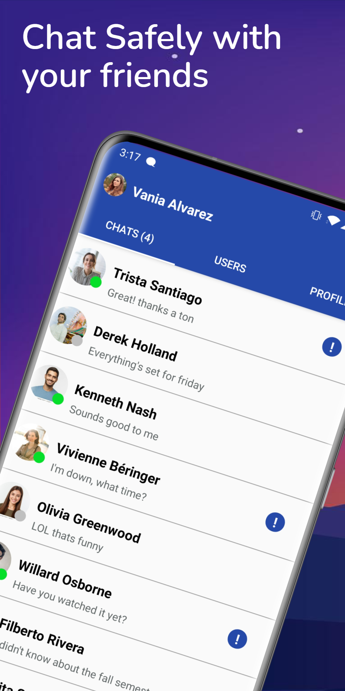
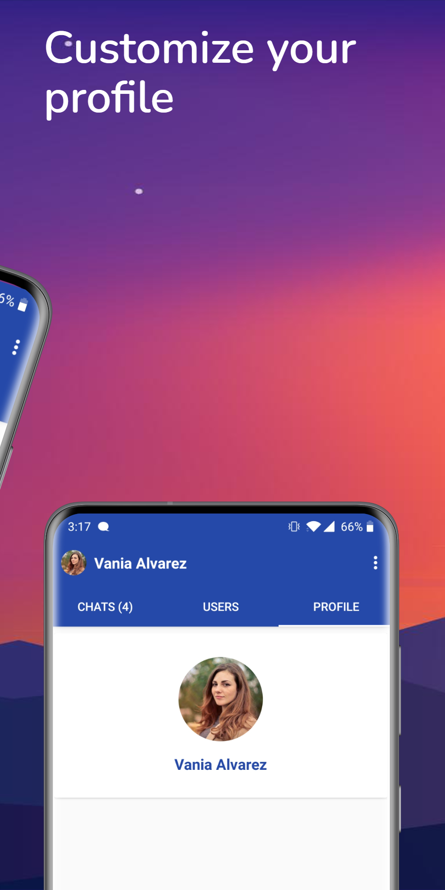
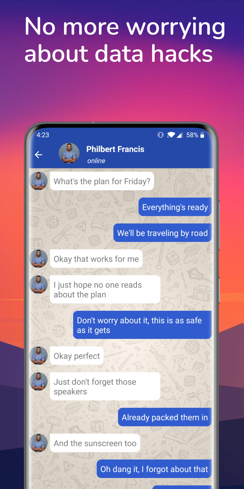
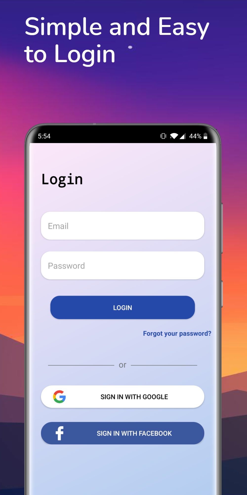

# SafeChat

SafeChat is a FREE messaging app with highly sophisticated end to end encryption. You can now connect with friends and family without worrying about data leaks or breach of privacy.

Available at: https://play.google.com/store/apps/details?id=com.hingorani.safechat

&nbsp;&nbsp;&nbsp; &nbsp;&nbsp; &nbsp;&nbsp;&nbsp; &nbsp;&nbsp;&nbsp;  &nbsp;&nbsp;&nbsp;&nbsp;&nbsp;&nbsp; &nbsp;&nbsp; &nbsp;&nbsp;&nbsp; &nbsp;&nbsp;&nbsp; &nbsp;&nbsp;&nbsp; &nbsp;&nbsp;&nbsp; &nbsp;&nbsp;&nbsp;

Why use SafeChat:

Secure: The primary goal of this app was to create a highly advanced encryption algorithm to ensure absolute privacy. With SafeChat, no more worrying about your data being sold or getting hacked. It ensures absolute isolation of each message from the outside world.

Privacy: We will never sell your data to third party applications or view and utilize your data ourselves, that is the SafeChat guarantee.

Simple: SafeChat is a highly intuitive app and even as it offers a wide variety of features, the UI is clutter-free and simple to use for all age groups/demographics.

Easy Login/Sign Up: SafeChat is integrated with Google and Facebook login methods for quick and easy sign up/login.

Fast: SafeChat is one of the fastest messaging apps despite its advanced and highly secure encryption algorithms.

Reliable: SafeChat works seamlessly without any interruptions or delay.

Free: Despite a plethora of cool features, SafeChat is completely free software with no ads or disruptions.

&nbsp;&nbsp;&nbsp;&nbsp;&nbsp;&nbsp;&nbsp;&nbsp;&nbsp;

SafeChat will keep improving and pushing the limits of technology every day. Don’t just be another user for others to mine data from and exploit, switch over to SafeChat today for a truly secure experience!
